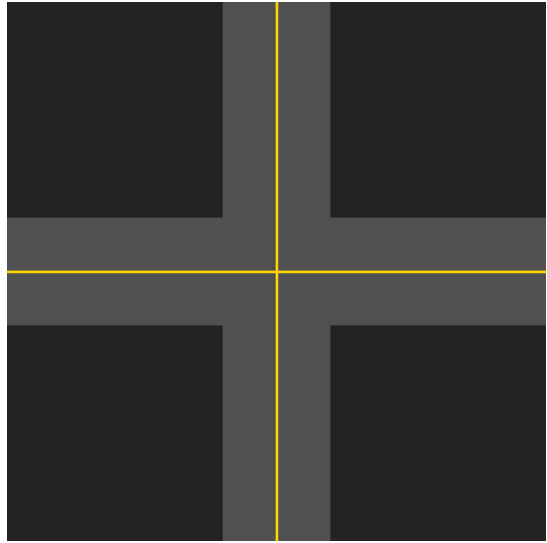
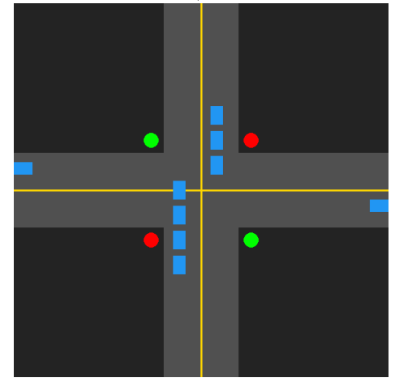
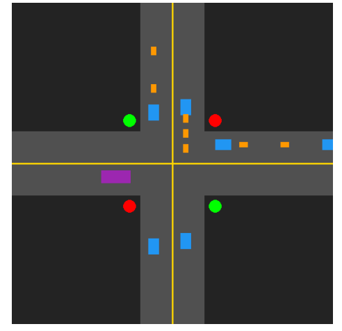
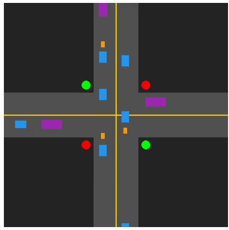
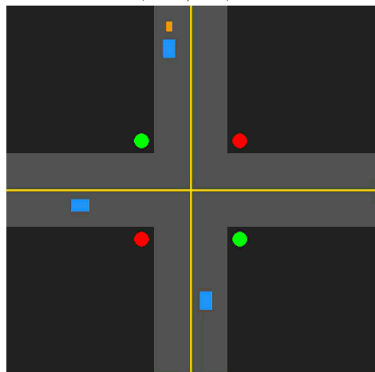

# AI-Assisted-Traffic-Signaling-System(AIATSS)
 ## *The Inspiration:*
 One of the main problems faced in my home country, India-and in particular, my home city of Hyderabad(which is a with most number of private ownership of cars in India)-is the traffic congession due exteremly long waiting times at signals. Most of these signals are located in high-traffic zones where people communte to their offices,schools,etc and they are manually operated or set to a fixed timer on when to show red and when to show green(sometimes even  300secs). The person who is managing these signals usually unable to predict which direction he has to give priority to and when a timer is used, it fails adapt to change in traffic volumes throughout the day.For example, at night 10pm also the signal shows 300seconds of waiting time which is unnecessery as at that time there is not much traffic. I myself got frusted because of these siganls while I was going to the school or travelling somewhere .Also these long waiting times also have many environmental damages like,Nosie Pollution, Air Pollution, and also make you frusted while you have to reach school/office by 8 o'clock and these gave me an inspiration to create an AI system which can adapt and implement according to time and traffic density.Which I named as AI Assisted Automatic Traffic Signaling System(AIATSS).

## *Built With*

The AIATSS is made by using Python Programming language. It is fast,efficient, powerful,simple, easy to understand and code.
To Visualise on how code works and how the vehicles and simulate a real world scenarios, I used Pygame software which allows us to build a 2-D Graphical User Interface(GUI).This allows us to animate traffic flow, visually see the process, track vehicle coordination,etc.

## *Intersection and Road layout*:
To focus more on signaling logic, the layout is kept simple, basic and easy to interpret:

**Intersection Grid:** A classic 4-intersention maps out traffic flow form all four directions **North, South, East and West**.Each road has its own signal situated right before the crossing zone.

**Lanes:** Each road is designed as a two way street where "the yellow colour line" seperates the 2 opposite traffic lanes . Only two-lane setup chosen was chosen to maintain simplicity. 

**Stop Coordinates:** Specific pixel thresholds are mapped out on the Pygame coordinate system directly behind the crosswalk area, acting as the hard boundary line where vehicles must poll the signal state and come to a complete stop during a red phase or continue in their path during the green phase.

    

## *Vehicle Object Modeling*
Instead of just using random shapes as Vehicles, The code treates vehicles as unique entities by using Object-Oriented Programming.
there are 3 types of vehicles used in the code(only used 3 for simplicity) and each vehicle type is assigned its own real world(bounding box size) and natural speed limits.

1)Motorbikes(orange in colour) are small, agile and move fast

2)Cars(Blue in Colour), take up average lane space and move at normal speeds 

3)Buses(Violet in colour) are large, move slowly and require large gap to halt  

## *Simulation Mechanics and Core Logic*

The working of AIATSS relies mainly on 2 main software engines running simultaneously inside the Pygame loop:

### 1) Proxymity Based Collision Detection: 
(not needed for real life application but for the software to work propely minimising vehicle overlapping in Pygame)

To Prevent vehicles from overlapping or clinging to each other as they travel down the lane, the code implements a real time safety boundary buffer. The Systems that help maintain these are:

**Distance Check**: Each and every vehicle monitors pixel coordinate gap between its front and rear of the vehicle ahead of it in the same lane. 

### 2) The Dynamic AI Signaling Override: 
This is a core and main feature of the AIATSS which can be used in real life appliction and it solves the problem of real world problem faced like 300-second dead timer as mentioned above and which side to give priority red or green accourding to the traffic density. 

Instead of blindly counting down, the siganlling framework acts like an intelligent traffic controller:

**Live Density Tracking:** The algorithm constantly counts the active vehicle objects waiting in the Horizontal lanes (East/West) versus the Vertical lanes (North/South).

**Congestion Override**: This is Personally my favorite part of the AIATSS as this part solves one of the main problems I have with the traditional signals. If a green lane becomes completely clear of traffic(or if the active vehicle flow drops below a minimum threshold) while the opposing red lane develops a massive queue of vehicles, the system instantly detects the density imbalance. It overrides the remaining timer, triggers a yellow transition phase, and immediately gives the green light to the congested lane to clear the congession. 

**Two Recordings showing the process happen**

     

###Future Improvements:

Of course this still a basic model and there is a lot of work to be done and new features to add some of them that i have in mind are:

**Syncronizing with adjecent/Nearby signals:**
